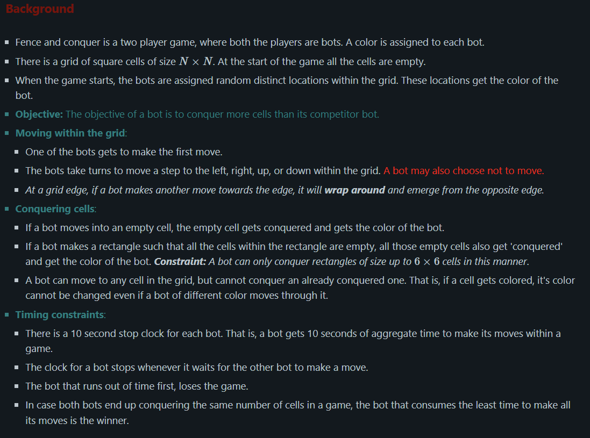
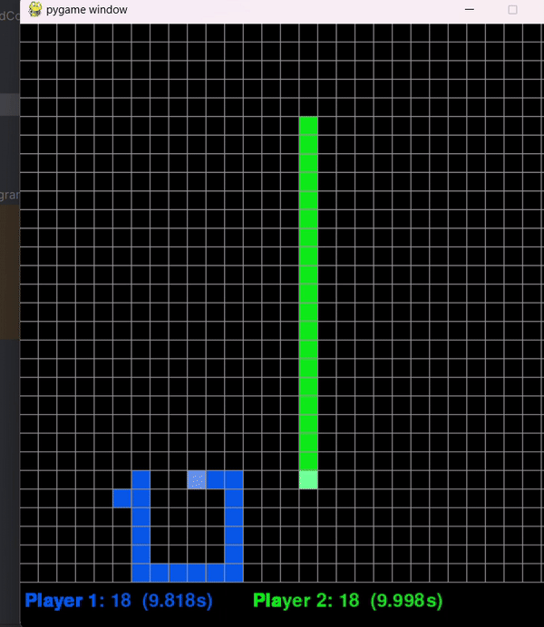

# Fence & Conquer

To run, type the following command in the directory fence-and-conquer:

    python3 game.py

# Player1(blue:our_bot) vs Player2(green)

Feel free to program player2 to compete against our player1!